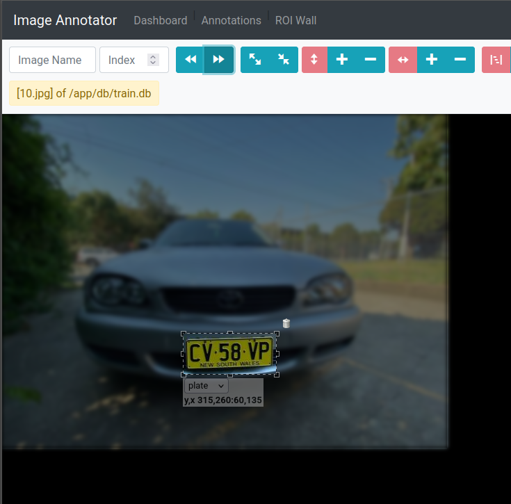
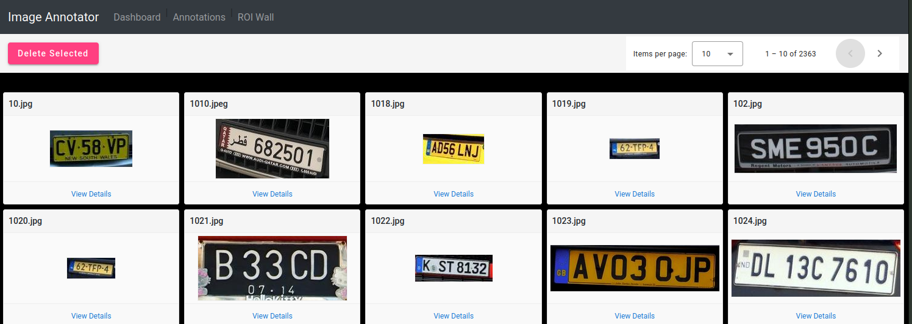

|Repository|Last commit|Docker CI Health|Docker pulls|
|---|---|---|---|
|Scripts||[](https://github.com/faisalthaheem/simanno-scripts/actions/workflows/docker-image.yml)||
|Backend||[](https://github.com/faisalthaheem/simanno-be/actions/workflows/docker-image.yml)||
|Frontend||[](https://github.com/faisalthaheem/simanno-fe/actions/workflows/docker-image.yml)||


# About

Simple Image Annotation (SimAnno) Tool for Deep Learning Projects.

SimAnno is a browser based image annotation tool that uses sqlite database(s) to maintain annotations for images and consists of a front and backend written in Angular and FastAPI.

## Warning - outdated/w.i.p documentation ahead

## Modules

|Module|Location|
|---|---|
|Documentation|https://github.com/faisalthaheem/simanno|
|Backend|https://github.com/faisalthaheem/simanno/be|
|Frontend|https://github.com/faisalthaheem/simanno/fe|
|Scripts|https://github.com/faisalthaheem/simanno-scripts|

At the heart of the project is the great [jquery select areas plugin](https://github.com/360Learning/jquery-select-areas).

The tool makes it easy to keep images on a headless environment and access them from any web browser. Once images have been tagged, a training record can be generated to be fed to the learning/evaluating scripts.
See [life2tfrec.py](https://github.com/faisalthaheem/deep-learning-scripts/blob/master/dbutils/lite2tfrec.py) for an example of how the databases generated by this tool are being used.

## Running with docker
The easiest way to run is using Docker compose. The following instructtions are tested on linux, but, should work on Windows as well.

```bash
$ git clone https://github.com/faisalthaheem/simanno
$ cd simanno
$ chmod +x build-images.sh && sh build-images.sh
$ docker compose up -d
```
Open your browser to http://localhost:8181 and you're good to go.

## Running outside of docker (ToDo)
Please use a virtual env for the backend (ws) and install the requirements.txt dependencies. The frontend is an AngularJS app and will work with issuing the following commands: npm install && npm run start

## IMPORTANT - understanding image serving and label tagging

The backend serves images from an `Image directory`. The labels and path configuration are defined in the `imanno.yaml` file. Labels list, database and image paths can be modified using the config file.

The imanno.yaml file (see folder "be" for the default) has the following structure
```yaml
labels: #Any labels defined here will become available in the angular app
  list:
    1: plate
    2: signal
  default: 1 #The default selected label in the angular app
anno:
  dbs: ./db/sample.db #location of the db, here it's relative to the working directory
  rawimgs: ./sample-images #same as refimgs, depreacted and will be removed in future versions
  refimgs: ./sample-images #location of images to be served to the angular app and later fed to the model for training
  createIfAbsent: True #create a record if missing in the database: default is True, deprecated
```

The sample docker-compose.yml in this repo maps 3 important resources into the docker container, these are as below:

| # | resource |Description |
|---|---|---|
| 1 | Image directory (./be/sample-images) | Contains images to be annotated |
| 2 | imanno.yaml (./be/imanno.yaml) | Contains the labels, and, paths to the images and database |
| 3 | Sqlite database (./be/db/sample.db) | Used to save annotations |

A brief description of the docker compose file follows:

```yaml
version: "3"

services:
  ws:
    image: faisalthaheem/simanno-be:latest
    volumes:
     - $PWD/be/imanno.yaml:/app/imanno.yaml #The CMD in docker file expects this file at this location
     - $PWD/be/sample-images:/app/images #The default imanno.yaml (previous line) file expects this directory to be mounted at /app/images.
     - $PWD/be/db/sample.db:/app/db/sample.db #The default imanno.yaml file expects the database at this location.
    ports:
      - "8000:8000"

  web:
    image: faisalthaheem/simanno-fe:latest
    ports:
      - "8181:80"
```


# Demo


## Annotation Screen
The annotation screen provides an intuitive, browser-based interface for efficiently marking and labeling regions of interest in images. With support for precise area selection, you can quickly define bounding boxes around objects of interest, making it ideal for preparing datasets for deep learning projects.

Key features include:
- Intuitive area selection and labeling interface
- Support for multiple labels and categories
- Seamless integration with SQLite database backend
- Responsive design that works across all modern browsers
- Efficient workflow for image annotation tasks



## ROI (Regions Of Interest) Wall

The ROI Wall provides a comprehensive overview of all annotated regions from your dataset, enabling quick review and validation of your annotation work. This feature allows users to:

- Visualize all annotated regions in a grid layout for quick assessment
- Easily identify and review areas of interest across multiple images
- Validate annotation quality and consistency
- Quickly spot any missed or incorrectly labeled regions
- Streamline the data validation process for machine learning projects

The ROI Wall serves as a powerful quality control tool that helps ensure your annotated datasets meet the required standards for training effective deep learning models.



# Issues and Feedback
Please use the issues link on the top to report any issues/feedback/suggestions.

# Scripts

There are few useful scripts that faciliate data import and export to/from simanno. The following section describes these briefly.

## code/import-cat-from-coco.py

> Using this script you can extract a category of images from the COCO dataset.

The scripts expects the following arguments
The comand expects the following arguments
```bash
usage: import-cat-from-coco.py [-h] -c CATEGORY -t TYPE -li LBLID -af ANNOTATIONFILE -sp SRCPATH -dp DESTPATH

optional arguments:
  -h, --help            show this help message and exit
  -c CATEGORY, --category CATEGORY
                        The category to extract.
  -t TYPE, --type TYPE  Type to assign to images, accepted values are train or val, default is train.
  -li LBLID, --lblid LBLID
                        The label id to be used for this category.
  -af ANNOTATIONFILE, --annotationfile ANNOTATIONFILE
                        Path to annotation file.
  -sp SRCPATH, --srcpath SRCPATH
                        Path of source containing images.
  -dp DESTPATH, --destpath DESTPATH
                        Path to destination to create the db and save images to.
```

For instance, the following command extracts all images belonging to the "cars" category and moves them to a destination folder while also creating a stand alone sqlite db that works with simanno.
```bash
python3 import-cat-from-coco.py \
-t val -c car -li 1 \
-af $COCO_PATH/annotations/instances_val2017.json 
-dp $CARS_FROM_COCO_PATH 
-sp $COCO_PATH/val2017/
```

Where, the parameters are
|Parameter|Valid values|Description|
|---|---|---|
|-t |val or train| Type of dataset that is being created for simanno. Influences the names of db file and destination folder.|
|-c |string| Name of category that should exist in coco dataset.|
|-li|integer| The label index to be assigned when records are added to db. Label text is taken from the -c parameter.|
|-af|path| Path to the coco annotations file.|
|-dp|path| Path to the destination folder which will contain a database file and a folder containing images copied from the coco dataset.|
|-sp|path| Path to the source folder containing coco images to be copied from into the destination folder.|


Alternatively you can use the docker-container version to run this script with the following command
```bash
docker run --rm -it -u $UID -v $PWD:/datasets faisalthaheem/simanno-scripts:main "/usr/local/bin/python3.8 import-cat-from-coco.py -t val -c car -li 1 -af /datasets/coco/annotations/instances_val2017.json -dp /datasets/cars_from_coco -sp /datasets/coco/val2017/"
```

```bash
docker run --rm -it -u $UID -v $PWD:/datasets faisalthaheem/simanno-scripts:main "/usr/local/bin/python3.8 import-cat-from-coco.py -t train -c car -li 1 -af /datasets/coco/annotations/instances_train2017.json -dp /datasets/cars_from_coco -sp /datasets/coco/train2017/"
```

> Notice "/usr/local/bin/python3.8" which is important in the image

## code/mergedbs.py
> For merging multiple simanno datasets into a single set for training and validation.

This script uses a yaml configuration file as input and provides remapping of the source labels in addition to merging annotations db table and files. 

As output train and val folders containing images and train and val dbs are produced. 

If the destination dbs exist then they are deleted before re-generation, files are only copied again if missing in destination.


For an example of a sample merge config file please take a look at
```bash
conf/scripts/mergedbs.sample.yaml
```

The comand expects the following arguments
```bash
usage: mergedbs.py [-h] -c CONFIGFILE

optional arguments:
  -h, --help            show this help message and exit
  -c CONFIGFILE, --configfile CONFIGFILE
                        Path to the merge config file.
```

To execute, use the following command
```bash
python3 mergedbs.py -c mergedbs.yaml
```

Or, use the docker variant as given below, assuming you're in the folder containing all your datasets
```bash
docker run --rm -it -u $UID -v $PWD:/datasets faisalthaheem/simanno-scripts:main "/usr/local/bin/python3.8 /simanno/scripts/mergedbs.py -c /datasets/mergedbs.yaml"
```

## code/splitdb.py
> For splitting a common db into two given input a folder containing images.

Given there is a simanno database that contains annotation of images contained in several folders, this script allows to split this database into several independent files thus allowing for better management of the training data.

To execute the script directly, a command similar to following can be used
```bash
python3 splitdb.py -r $PLATE_DETECTION_PATH/train -o $PLATE_DETECTION_PATH/train.db -i $PLATE_DETECTION_PATH/train_and_val.d
```

Or, if using the docker image, then following command accomplishes the same result
```bash
docker run --rm -it -u $UID -v $PWD:/datasets faisalthaheem/simanno-scripts:main "/usr/local/bin/python3.8 /simanno/scripts/splitdb.py -r /datasets/plate_detection/train -o /datasets/plate_detection/train.db -i /datasets/plate_detection/train_and_val.db"
```

The comand expects the following arguments
```bash
usage: splitdb.py [-h] -r REF -o OUT -i IN

optional arguments:
  -h, --help         show this help message and exit
  -r REF, --ref REF  Path to the folder containing ref images.
  -o OUT, --out OUT  Path to the destination db which will be created bearing contents related to ref folder images.
  -i IN, --in IN     Path to the source db containing information on ref images.
```